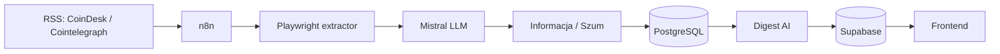

# StreszCzarka

StreszCzarka to automatyczny system do monitorowania wiadomości branżowych i budowania krótkich podsumowań z użyciem AI.

Co kilka minut sprawdza źródła RSS, pobiera pełną treść nowych artykułów przez Playwright, usuwa duplikaty, streszcza tekst, oddziela **informację** od **szumu** i zapisuje wynik. Kilka razy dziennie z zebranych materiałów powstaje zbiorczy digest publikowany przez Supabase i prosty frontend.



## Technologie

- **n8n** — harmonogramy i orkiestracja procesu
- **Node.js / Express** — usługi API
- **Playwright** — pobieranie treści stron
- **Mistral AI** — streszczanie i klasyfikacja
- **PostgreSQL** — robocza baza artykułów, szumu i historii URL
- **Supabase** — publikacja gotowych podsumowań i danych dashboardu
- **Docker Compose** — uruchamianie usług na VPS
- **HTML / JavaScript** — lekki frontend

## Uruchomienie

1. Skopiuj `.env.example` do `.env` i ustaw hasło bazy oraz `INTERNAL_API_KEY`.
2. Uruchom usługi:

```bash
cp .env.example .env
docker compose up -d --build
```

3. W Supabase uruchom `supabase/schema.sql`.
4. Zaimportuj workflowy z katalogu `workflows/` do n8n i podepnij własne credentiale Mistral oraz Supabase.
5. Ustaw w środowisku n8n adresy usług opisane w `docs/SETUP.md`.
6. Frontend można wystawić jako prosty Static Site, np. na Render.

Dokładna konfiguracja: **[docs/SETUP.md](docs/SETUP.md)**.

## Zawartość repo

```text
workflows/                  aktualne workflowy n8n
services/article-extractor/ Playwright → tekst artykułu
services/storage-api/       własne API + PostgreSQL
supabase/                   schema publikacyjna
frontend/                   statyczny frontend
```

## Status

To uporządkowana, portfolio-safe wersja działającego prototypu. Historycznie system działał na VPS, a frontend był serwowany osobno. W tej wersji komponenty zostały zebrane w jedno repozytorium i oczyszczone z credentiali oraz prywatnych adresów infrastruktury.
